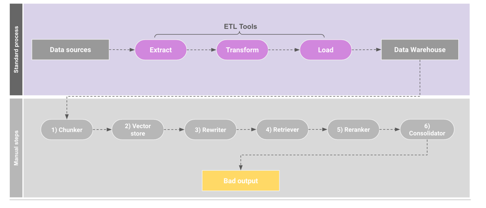
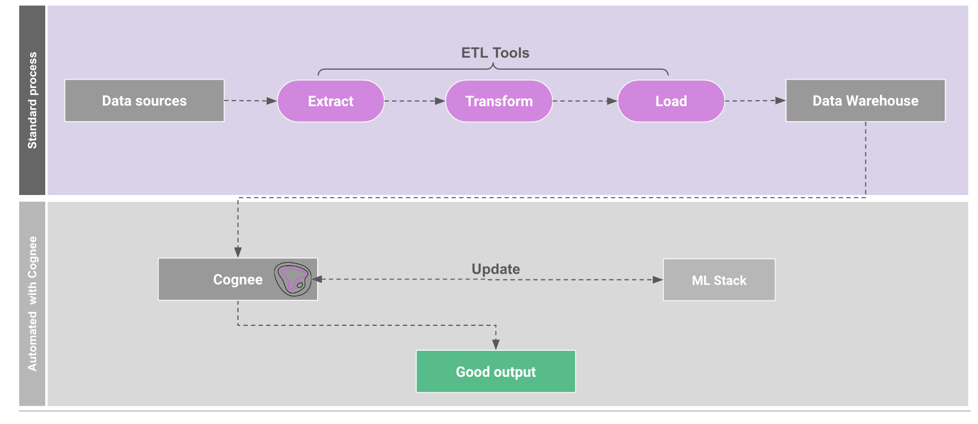

# Why use cognee?

cognee is one of the first OSS tools that enables easy, scalable and flexible use of LLMs to process large volumes of documents using GraphRAG approach. 

LLMs don't have a semantic layer, and they don't have a way to understand the data they are processing. This is where cognee comes in. 
We let you define logical structures for your data and then use these structures to guide the LLMs to process the data in a way that makes sense to you.

cognee helps you avoid the overly complicated set of tools and processes to give you somewhat reliable output

***From***

***To***

??? note "Why use cognee?"

    Its hard to answer the question of why use cognee without answering why you need thin LLM frameworks in the first place.:)
 - **Cost-effective** — cognee extends the capabilities of your LLMs without the need for expensive data processing tools.
 - **Self-contained** — cognee runs as a simple-to-use library meaning you can add it to your application easily
 - **Easy to use** — Navigate graphs instead of embeddings to understand your data faster and better
 - **Flexible** — cognee lets you control your input and provide your own Pydantic data models.

